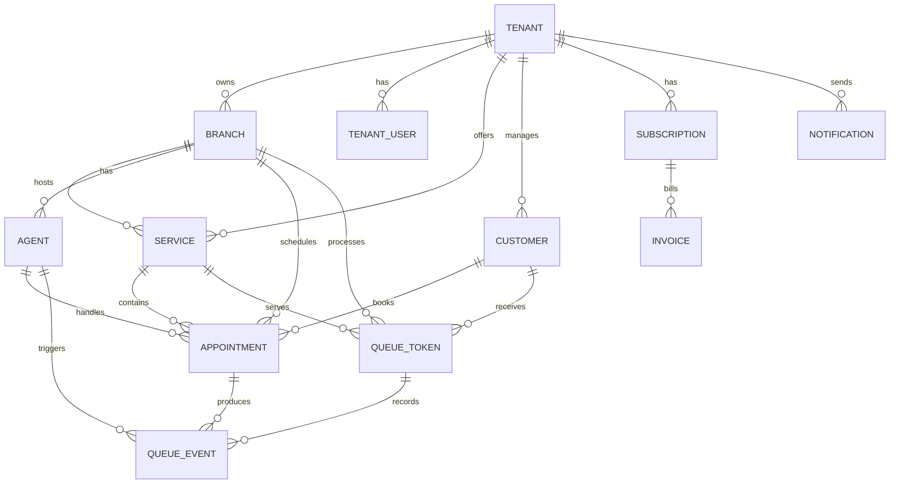

# ER Diagram

```mermaid
erDiagram
    TENANT ||--o{ BRANCH : owns
    TENANT ||--o{ TENANT_USER : has
    TENANT ||--o{ SERVICE : offers
    TENANT ||--o{ CUSTOMER : manages
    TENANT ||--o{ SUBSCRIPTION : has
    TENANT ||--o{ NOTIFICATION : sends

    BRANCH ||--o{ SERVICE : hosts
    BRANCH ||--o{ AGENT : has
    BRANCH ||--o{ APPOINTMENT : schedules
    BRANCH ||--o{ QUEUE_TOKEN : processes

    CUSTOMER ||--o{ APPOINTMENT : books
    CUSTOMER ||--o{ QUEUE_TOKEN : receives

    SERVICE ||--o{ APPOINTMENT : contains
    SERVICE ||--o{ QUEUE_TOKEN : serves

    AGENT ||--o{ APPOINTMENT : handles
    AGENT ||--o{ QUEUE_EVENT : triggers

    APPOINTMENT ||--o{ QUEUE_EVENT : produces
    QUEUE_TOKEN ||--o{ QUEUE_EVENT : records
    SUBSCRIPTION ||--o{ INVOICE : bills
```

## Notes

This diagram captures the primary relationships among multi-tenant ownership, branch operations, customer flow, queue lifecycle, billing, and notifications.
